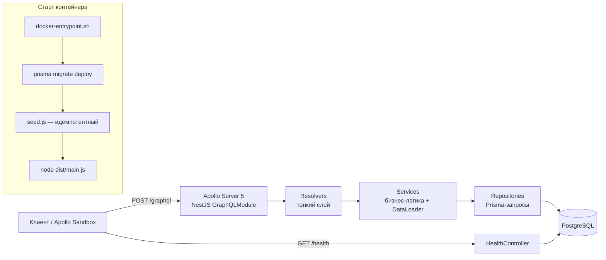
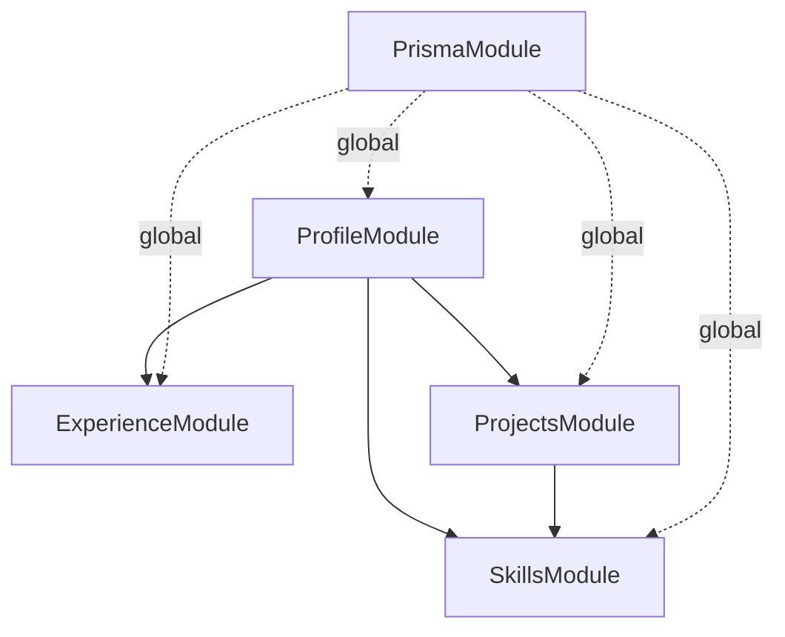
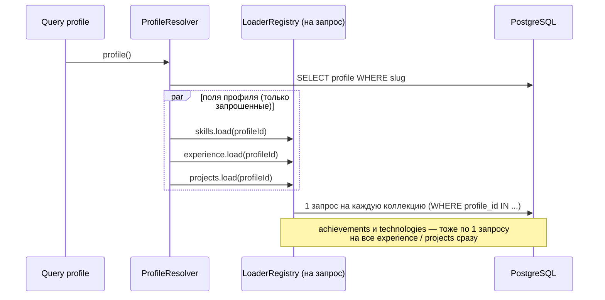
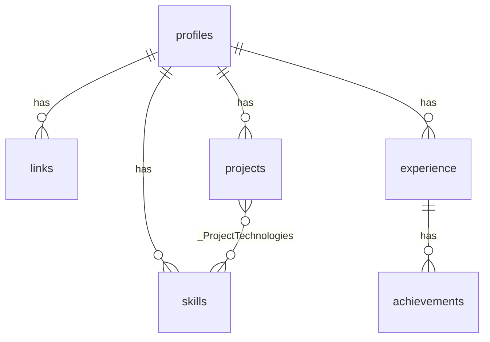

# Architecture

Документ фиксирует устройство приложения и причины решений. Если меняешь что-то из описанного — обнови документ.

## 1. Назначение и требования

Backend-визитка, которая через Apollo Sandbox отдаёт информацию о владельце.

Обязательные требования задания:

| Требование | Где выполнено |
|------------|---------------|
| Git, TypeScript, Node.js, NestJS, Prisma, GraphQL, Docker | весь репозиторий |
| Apollo Sandbox | `src/graphql/graphql.config.ts` (landing page plugin, `/graphql`) |
| Профиль: имя, описание, ссылки | `Profile`, `Link` |
| Навыки | `Skill` (+ `skillGroups`) |
| Опыт: компания, должность, период, достижения | `Experience`, `Period`, `Achievement` |
| Проекты: название, ссылка | `Project` (`url`, `repositoryUrl`, `technologies`) |
| Автоподготовка и заполнение БД при запуске | `docker-entrypoint.sh` → `prisma migrate deploy` + `dist-seed/seed.js` |
| Запрос `profile { ... }` без аргументов | `ProfileService.getBySlug()` → `DEFAULT_PROFILE_SLUG` |

## 2. Общая схема



## 3. Структура кода

```text
src/
  main.ts                         bootstrap: CORS, shutdown hooks, PORT
  app.module.ts                   сборка модулей
  config/env.validation.ts        Joi-схема env + тип EnvironmentVariables
  prisma/                         PrismaService (@Global)
  health/health.controller.ts     GET /health → SELECT 1
  graphql/
    graphql.config.ts             Apollo: autoSchemaFile, Sandbox, formatError
    graphql-context.ts            контекст запроса { loaders: LoaderRegistry }
    loaders/loader-registry.ts    LoaderRegistry + createOneToManyLoader
  modules/
    profile/     Query profile/profiles, поля links/skills/skillGroups/experience/projects
    skills/      SkillsService (byProfile, byProject, group), модели Skill/SkillGroup
    experience/  ExperienceResolver (period, achievements), period.ts — чистая функция
    projects/    ProjectsResolver (technologies → SkillsService)
prisma/
  schema.prisma, migrations/
  data/profile.data.ts            ЕДИНСТВЕННЫЙ источник личных данных
  seed.ts                         идемпотентный сид
test/app.e2e-spec.ts              e2e на реальной БД
```

### Граф зависимостей модулей



Циклов нет. Модули экспортируют только сервисы.

## 4. Слои и ответственность

- **Repository** — знает Prisma и SQL-порядок сортировки. Методы батчевые: принимают массив id родителей.
- **Service** — бизнес-правила: профиль по умолчанию, фильтр по категории, группировка навыков в порядке enum,
  расчёт периода работы, доменные ошибки (`NotFoundException`). Владеет своими DataLoader'ами.
- **Resolver** — только маппинг схемы на сервисы.
- **Models** — публичный контракт GraphQL, намеренно не равен таблицам (`period` вычисляется, `achievements`
  отдаются как `[String!]!`, хотя лежат в отдельной таблице).

## 5. GraphQL

Code-first, схема генерируется в `schema.gql` (в production — только в памяти).

```text
Query
  profile(slug: String): Profile!        # без slug → DEFAULT_PROFILE_SLUG
  profiles: [Profile!]!
Profile   id slug name headline description location
          links: [Link!]!
          skills(category: SkillCategory): [Skill!]!
          skillGroups: [SkillGroup!]!
          experience: [Experience!]!     # текущие первыми, затем по дате начала desc
          projects: [Project!]!
Experience id company position location period: Period! achievements: [String!]!
Period    startDate endDate isCurrent durationMonths label
Project   id name description url repositoryUrl technologies: [Skill!]!
Skill     id name category
```

### Разрешение вложенных данных



Итог: число SQL-запросов зависит от **глубины** запроса, а не от количества объектов.

## 6. База данных



- Всё удаляется каскадно вместе с профилем.
- `skills` уникальны в рамках профиля (`@@unique([profileId, name])`) — по этому ключу сид связывает проекты с навыками.
- `position` задаёт порядок отображения, `experience.end_date = NULL` — текущее место работы.
- Схема поддерживает несколько профилей; визитка использует один.

## 7. Инициализация данных

`prisma/data/profile.data.ts` → `prisma/seed.ts`:

1. Валидация: все `projects[].technologies` существуют в `skills`.
2. Одна транзакция: upsert профиля по `slug`, удаление дочерних коллекций, создание заново в порядке массива.

Запускается при каждом старте контейнера — безопасно, данные всегда соответствуют файлу.
Локально: `npm run db:seed` (ts-node), в Docker: `node dist-seed/seed.js` (компилируется `tsconfig.seed.json`).

## 8. Конфигурация

Валидируется Joi при старте (`src/config/env.validation.ts`), невалидный env → приложение не стартует.

| Переменная | Default | |
|------------|---------|--|
| `DATABASE_URL` | — | обязательна, postgres(ql):// |
| `PORT` | 3000 | Render подставляет свой |
| `GRAPHQL_SANDBOX` | true | Sandbox + introspection |
| `DEFAULT_PROFILE_SLUG` | igor-mirkhanov | |

## 9. Docker и деплой

- Multi-stage `Dockerfile` на `node:22-alpine` (libssl3 уже в образе, отдельный `apk add openssl` не нужен).
  Runtime-образ: prod-зависимости + `dist/` + `dist-seed/` + `prisma/`, пользователь `node`, `HEALTHCHECK` на `/health`.
- `docker-compose.yml`: `db` (postgres:16-alpine, healthcheck) + `api` (стартует после healthy БД).
- `render.yaml`: Blueprint для Render (Docker web service + PostgreSQL, free).
- CI `.github/workflows/ci.yml`: lint → unit → migrate+seed → e2e → build; отдельный job поднимает compose с нуля.

## 10. Решения и компромиссы

| Решение | Почему | Альтернатива |
|---------|--------|--------------|
| Code-first GraphQL | типы TS и схема из одного места | schema-first + codegen |
| DataLoader через `LoaderRegistry` в контексте | нет request-scoped провайдеров (они «заражают» всё дерево DI), модули не знают друг о друге | централизованный `LoadersFactory` со всеми репозиториями |
| Repository-слой поверх Prisma | сервисы тестируются без БД, запросы в одном месте | Prisma прямо в сервисах |
| Сид «пересоздать коллекции» | просто, идемпотентно, данные = файл | diff-обновление по натуральным ключам |
| `achievements` в отдельной таблице | порядок, возможность расширить (метрики, ссылки) | `String[]` в Postgres |
| NestJS 11 / Prisma 6 | стабильные, проверенные версии; Nest 12 и Prisma 7+ ломают API | последние мажоры |
| Nest HTTP-исключения + `formatError` | сервисы не зависят от GraphQL | `GraphQLError` в сервисах |
